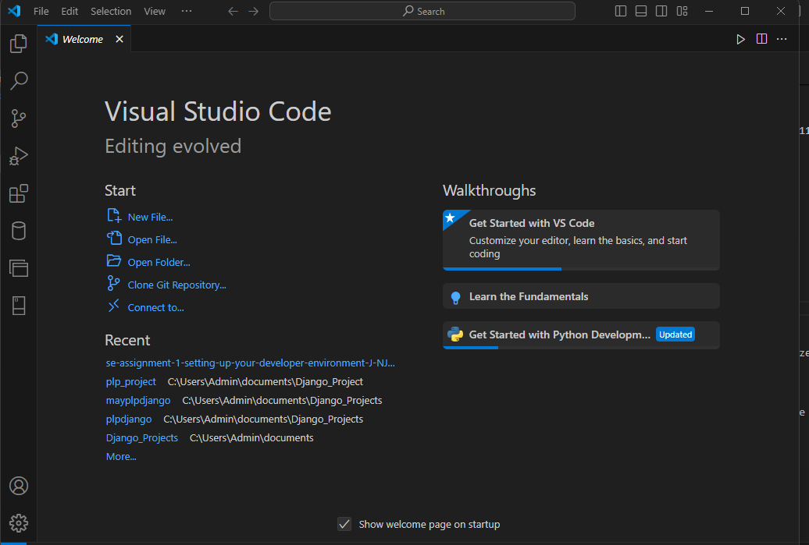
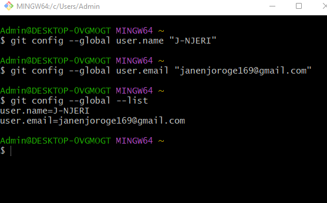
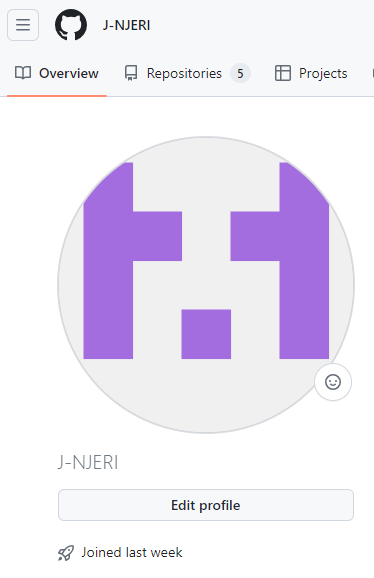

# Dev_Setup
Setup Development Environment

#Assignment: Setting Up Your Developer Environment

#Objective:
This assignment aims to familiarize you with the tools and configurations necessary to set up an efficient developer environment for software engineering projects. Completing this assignment will give you the skills required to set up a robust and productive workspace conducive to coding, debugging, version control, and collaboration.

#Tasks:

1. Select Your Operating System (OS):
   Choose an operating system that best suits your preferences and project requirements. Download and Install Windows 11. https://www.microsoft.com/software-download/windows11

   My device was procurred with Windows 11 pre-insalled. 
   

2. Install a Text Editor or Integrated Development Environment (IDE):
   Select and install a text editor or IDE suitable for your programming languages and workflow. Download and Install Visual Studio Code. https://code.visualstudio.com/Download

Following the link provided, I was able to access the download link for vs code in Windows. I then ran VSCodeUserSetup-x64-1.89.1 (the downloaded folder) as administrator. The next steps are setting up then installing and finally launching the app. After launching, I set my preferences and installed basic extensions. The image below shows my running visual studio code.

3. Set Up Version Control System:
   Install Git and configure it on your local machine. Create a GitHub account for hosting your repositories. Initialize a Git repository for your project and make your first commit. https://github.com

From this Git's official documentation (https://www.git-scm.com/download/win), I downloaded the 64bit standalone installer. I then accessed the  downloaded folder (Git-2.45.2-64-bit) and installed. 
 
This confirms whether the installation was successful.

This is to configure Git.
 
I created a GitHub account.
 
A git repository with a readme commit.

4. Install Necessary Programming Languages and Runtimes:
  Instal Python from http://wwww.python.org programming language required for your project and install their respective compilers, interpreters, or runtimes. Ensure you have the necessary tools to build and execute your code.

From the link provided, I was able to download python for windows and install.
 
I then confirmed whether the path has been set correctly in the user variables.
 
This confirms that the pyhton installation was successful.

5. Install Package Managers:
   If applicable, install package managers like pip (Python).

    
   This confirms that pip is successfully installed.

6. Configure a Database (MySQL):
   Download and install MySQL database. https://dev.mysql.com/downloads/windows/installer/5.7.html

   From the link provided above I was able to download the 32bit installer for windows. I then accessed the downloaded folder (mysql-installer-community-8.0.37.0) and followed the steps provided in the documentation (https://phoenixnap.com/kb/install-mysql-on-windows) to install.
   Since I chose server only in the setup type, I also downloaded (mysql-workbench-community-8.0.36-winx64) and installed MySQL Workbench separately.
   
    I the ran these commands to start the server for the first time and shut it down.
    
   This confirms the MySQL command line client is running and was able to show a previously created database.
    
   MySQL Workbench is also running.

7. Set Up Development Environments and Virtualization (Optional):
   Consider using virtualization tools like Docker or virtual machines to isolate project dependencies and ensure consistent environments across different machines.

8. Explore Extensions and Plugins:
   Explore available extensions, plugins, and add-ons for your chosen text editor or IDE to enhance functionality, such as syntax highlighting, linting, code formatting, and version control integration.

    
   These are the extensions currently installed in Visual Studio Code.

9. Document Your Setup:
    Create a comprehensive document outlining the steps you've taken to set up your developer environment. Include any configurations, customizations, or troubleshooting steps encountered during the process. 

#Deliverables:
- Document detailing the setup process with step-by-step instructions and screenshots where necessary.
- A GitHub repository containing a sample project initialized with Git and any necessary configuration files (e.g., .gitignore).
- A reflection on the challenges faced during setup and strategies employed to overcome them.

#Submission:
Submit your document and GitHub repository link through the designated platform or email to the instructor by the specified deadline.

#Evaluation Criteria:**
- Completeness and accuracy of setup documentation.
- Effectiveness of version control implementation.
- Appropriateness of tools selected for the project requirements.
- Clarity of reflection on challenges and solutions encountered.
- Adherence to submission guidelines and deadlines.

Note: Feel free to reach out for clarification or assistance with any aspect of the assignment.
